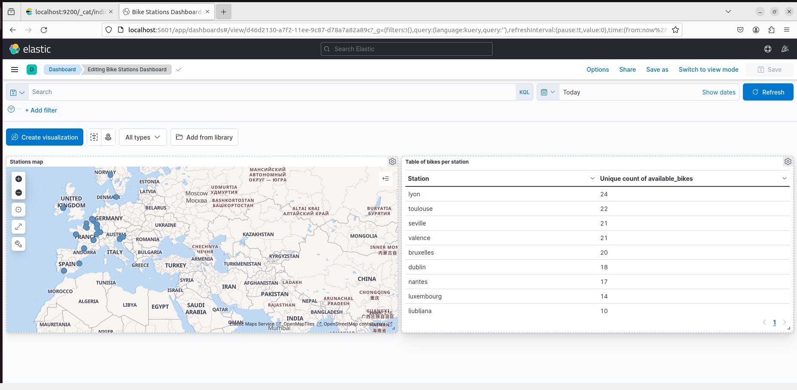
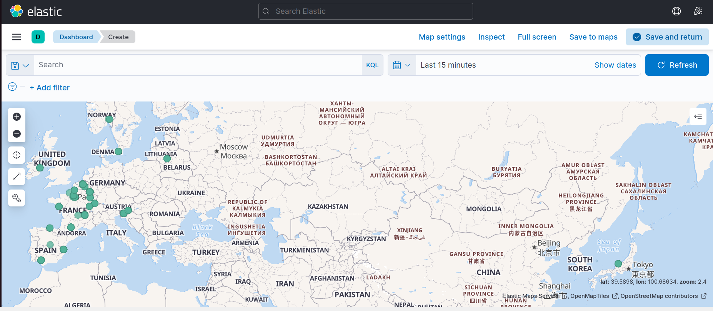
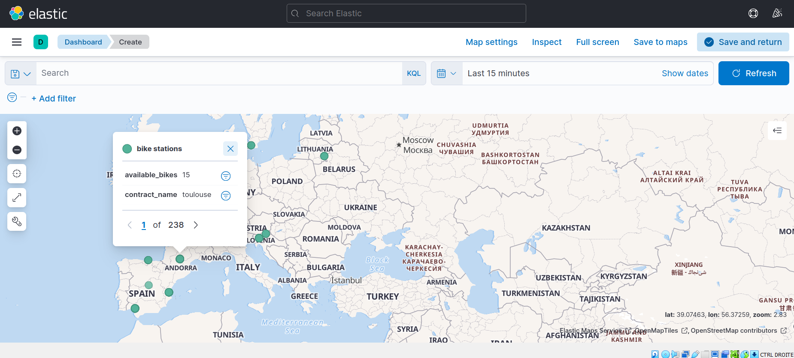
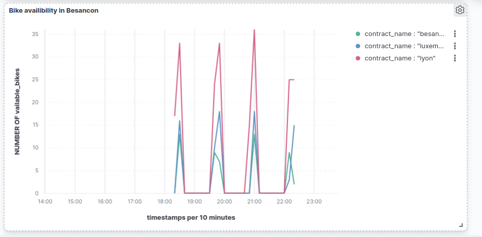

<h1 align="center">
  <br>
  Bike Stations Project
</h1>

<div align="center">
  <h4>
    <a href="#overview">Overview</a> |
    <a href="#requirements">Requirements</a> |
    <a href="#setup">Setup</a> |
    <a href="#kibana-visualizations">Kibana Visualizations</a> |
    <a href="#installation-guide">installation guide</a>
  </h4>
</div>

<br>


# Overview

This project aims to create a big data pipeline consisting of Kafka, Spark, Elasticsearch, and Kibana. Kafka serves as a broker to collect data from bike stations based on the JCDecaux website while Spark acts as the consumer, analyzing and structuring the data into a DataFrame, which is then saved to an Elasticsearch index. Finally, Kibana is used to visualize the data and track real-time availability of bikes and station statuses.
# Requirements

Technologies Used:

- Spark 3.2.4
- Kafka 
- Elasticsearch 7.17.15
- Kibana 7.17.15

For Python, ensure you have the following dependencies installed:

- `elasticsearch`
- `pyspark==3.2.4`
- `kafka-python`

You can install them using the following command:

```bash
pip install -r requirements.txt
```

# Setup

### Elasticsearch Setup:

1. Make sure Elasticsearch is running on `localhost:9200`.
2. The create_index script creates an index named "stations." 

### Kafka Setup:

- The procuer.py script reads data from a Kafka topic named "stations" on `localhost:9092`.
- In the file producer.py change the API key with yours after creating an account at https://developer.jcdecaux.com/#/opendata/vls?page=getstarted

### Spark Configuration:

- The Spark session is configured to connect to Elasticsearch on `localhost:9200`.

### Running the Script

Before executing the main pyspark_consumer.py, ensure that Zookeeper and Kafka servers are running. You can start them using the following commands in different terminals and IN THAT ORDER:

1. Start Zookeeper:

   ```bash
   ./bin/zookeeper-server-start.sh ./config/zookeeper.properties
2. Start Kafka:
    ```bash
   ./bin/kafka-server-start.sh ./config/server.properties
3. Run the producer.py file by doing
    ```bash
   python3 producer.py
4. start Elasticsearch:
    ```bash 
    sudo systemctl enable elasticsearch
    sudo systemctl start elasticsearch

Then you should run create_index.py script by doing
 ```bash 
    python3 create_index.py
 ```
after that you can run the main script with spark-submit
```bash
spark-submit --packages org.apache.spark:spark-sql-kafka-0-10_2.12:3.2.4,org.elasticsearch:elasticsearch-spark-30_2.12:8.8.2 ./spark-consumer.py
```
# Kibana Visualizations 
Open http://localhost:5601/ in your browser

### Kibana Dashboard



*Description:* This image displays the Kibana dashboard.

### Stations Map



*Description:* This image provides an overview of the stations map in Europe.

### Available bikes in Toulouse Station



*Description:* This image presents the map for bike stations and their capacity in the city of toulouse.

### Bike Count Evolution in 3 Chosen Cities



*Description:* This image illustrates the evolution of bike counts in three selected cities.


### Latest Bike Counts Table


*Description:* This image features the latest bike counts in different cities in the last 30 seconds.


